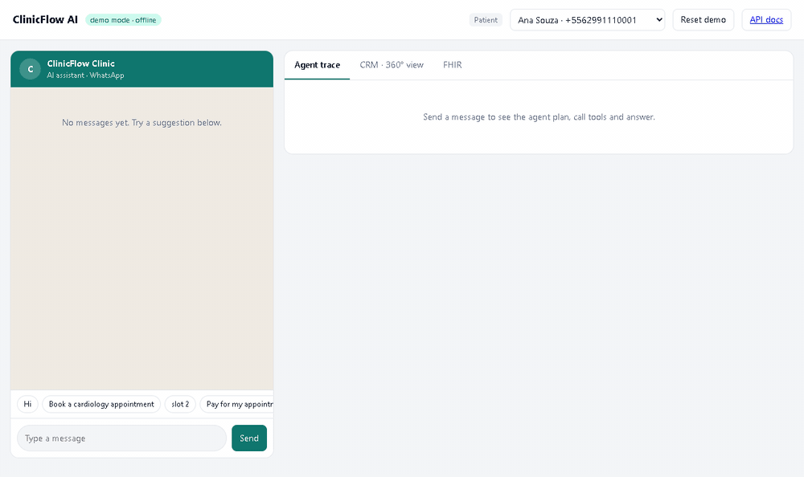
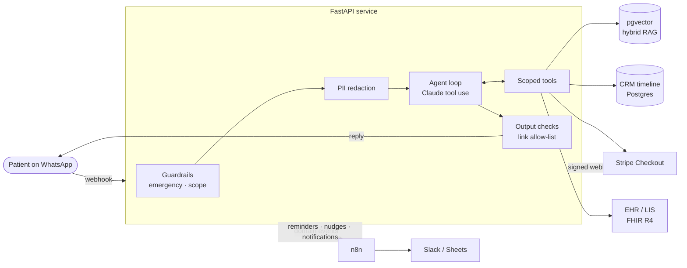
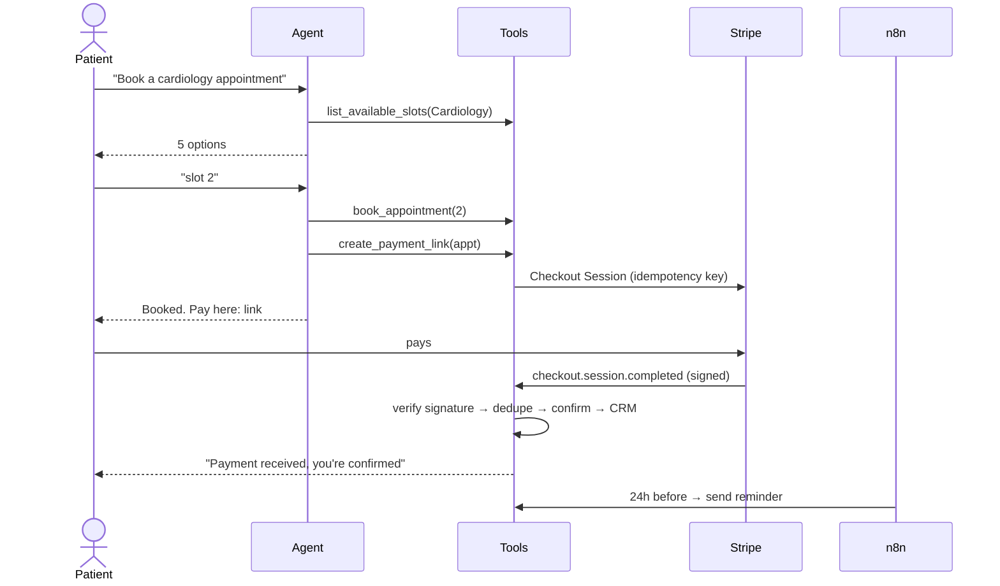

# ClinicFlow AI

**A WhatsApp AI agent for healthcare clinics.** It books and reschedules appointments, collects payments through Stripe, answers patient questions with RAG, delivers lab results from the EHR/LIS and keeps a 360° CRM timeline, orchestrated with n8n.

[](https://github.com/<your-github-user>/clinicflow-ai/actions)


> ClinicFlow AI is an open-source reference implementation of the AI patient-engagement platform I built and ran in production at a healthcare clinic in Brazil. It is rebuilt from scratch with synthetic data. No proprietary code or patient information is included.

<!-- Record a 20s GIF of the demo UI and save it as docs/demo.gif, then uncomment:

-->

---

## Why this exists

Clinic front desks spend most of their day on the same five requests: *book me in*, *move my appointment*, *how do I prepare for this exam*, *is my result ready*, *how do I pay*. ClinicFlow AI handles those on WhatsApp, 24/7, and hands everything else to a human with full context.

In production, the original system cut front-desk workload by up to 70% and booking time by 60%. This repository shows **how** it is engineered.

## Highlights

| | |
|---|---|
| 🤖 **Tool-using LLM agent** | Claude with native tool use and 9 scoped tools (book, reschedule, cancel, pay, results, search, handoff…). Multi-step plans, e.g. *find the appointment → cancel it*. |
| 📚 **Hybrid RAG** | Real sentence embeddings (`bge-small-en-v1.5`, local ONNX, no API key) in pgvector + BM25, fused with Reciprocal Rank Fusion, a calibrated relevance gate against off-topic grounding, and cited answers. |
| 💳 **Stripe payments** | Checkout Sessions with idempotency keys and **signed webhooks** (HMAC, timestamp tolerance against replay). Each event is processed exactly once. |
| 🏥 **EHR / LIS integration** | FHIR R4 facade (`Patient`, `Appointment`, `DiagnosticReport` with LOINC codes). Released results trigger a WhatsApp notification. |
| 🗂️ **CRM, single source of truth** | Every booking, payment, message and handoff lands on the patient's timeline: a 360° view for staff. |
| ⚙️ **n8n orchestration** | Importable workflows for 24h reminders, payment follow-ups and an event router (exam released → notify patient, handoff → Slack). |
| 🛡️ **Guardrails outside the model** | Emergency detection that bypasses the LLM, refusal of medical advice, a link allow-list against hallucinated or injected URLs, and a step budget that fails safe to a human. |
| 🔒 **Privacy by design (LGPD / HIPAA)** | CPF, phone, e-mail and card numbers are redacted **before** anything reaches the LLM provider and restored in the reply. Tool authorization is enforced in code, never in prompts. |
| 📏 **LLMOps** | 30-case offline eval suite (tool trajectory, grounding, safety, privacy) gating CI, **prompt caching** of tools + static instructions, and per-turn traces with latency and token/cache usage. |
| 🧪 **Runs with zero keys** | A deterministic demo mode drives the same agent loop, so anyone can clone it and try it in under a minute. |

## Architecture



**Booking and payment flow:**



## Quick start

**Option A: local, no dependencies (about 1 minute)**

```bash
python -m venv .venv
.venv/Scripts/activate        # Windows  (macOS/Linux: source .venv/bin/activate)
pip install -r requirements-dev.txt
uvicorn app.main:app --reload
```

Open http://localhost:8000. The demo runs on SQLite with synthetic patients. Pick a patient, click the suggestion chips, and watch the **Agent trace**, **CRM** and **FHIR** tabs update live. API docs are at http://localhost:8000/docs.

**Option B: full stack with Postgres + pgvector and n8n**

```bash
cp .env.example .env
docker compose up --build
docker compose exec n8n n8n import:workflow --separate --input=/workflows
```

The API runs at `:8000` and n8n at `:5678`. Activate the three imported workflows in n8n.

**Use the real model:** set `LLM_PROVIDER=anthropic` and `ANTHROPIC_API_KEY` in `.env`. Add `STRIPE_SECRET_KEY` (test mode) for real Checkout, and the WhatsApp Cloud API credentials to talk to real phones.

## Try these

| Message | What happens |
|---|---|
| `Book a dermatology appointment` → `slot <id>` | 3 tool calls: list slots → book → Stripe link |
| `Reschedule my appointment` → `slot <id>` *(as Bruno)* | Finds the appointment, offers slots, moves it |
| `Are my exam results ready?` *(as Ana)* | Final results are shown, preliminary ones are held back |
| `Do I need to fast before a lipid panel?` | Hybrid RAG answer with citation |
| `My CPF is 123.456.789-09, what are your hours?` | Answered; the CPF never reaches the LLM |
| `I have chest pain` | Emergency guardrail: SAMU 192, staff alerted, LLM bypassed |
| `Should I take ibuprofen?` | Medical-advice refusal, offers a consultation |
| `What's the capital of France?` | Out-of-scope refusal (relevance gate) |
| **CRM tab → Release result** | Simulates the lab signing off → WhatsApp notification |
| **Click a checkout link → Pay** | Signed webhook → appointment confirmed → confirmation message |

## Evals

`python -m evals.run_evals` runs 30 scenarios against a freshly seeded database and scores each one on **tool trajectory**, **RAG grounding** (top-1 citation), **required/forbidden content**, **guardrails** and **privacy** (a spy asserts that the listed values never appear in any payload sent to the LLM). CI fails below 95%.

| Metric | Score |
|---|---|
| **Overall pass rate** | **30/30 (100%)** |
| Tool-trajectory accuracy | 30/30 (100%) |
| RAG grounding (top-1 citation) | 10/10 (100%) |
| Safety guardrails | 4/4 (100%) |
| PII never sent to LLM | 1/1 (100%) |

**Read this before the 100%.** In CI the agent runs on a deterministic scripted policy that speaks the exact Anthropic tool-use protocol, so the scores validate the **system**: tool contracts, multi-step flows, retrieval, guardrails and privacy plumbing. They do not measure Claude's reasoning. To score the model itself, run the same suite with `LLM_PROVIDER=anthropic`. See [`evals/results.md`](evals/results.md) for every case.

The suite earned its keep during development. It caught two real bugs: a CPF inside the query was skewing retrieval (fixed by stripping identifiers from search queries), and an off-topic question was being "grounded" on an unrelated chunk through one shared word (fixed with a term-coverage relevance gate).

### Calibrating the relevance gate

Cosine scales differ a lot between embedding models, so the "is this chunk relevant at all?" threshold is set per provider **from measurements**, not guessed. Top-1 similarity with `bge-small-en-v1.5`:

| Query set | Top-1 cosine | Top-1 correct |
|---|---|---|
| 12 clinic questions, including paraphrases like *"can I get my money back if I cancel"* | **0.68 – 0.89** | 12/12 |
| 5 off-topic questions (trivia, code, weather, restaurants) | **0.43 – 0.57** | n/a (must be rejected) |

The gate sits at **0.62**, the midpoint of the gap, so off-topic questions are declined instead of being answered from the nearest random chunk.

## Engineering decisions

- **Authorization lives in code, not in the prompt.** Every tool runs in a `ToolContext` bound to the phone number that sent the message. The model cannot read or cancel another patient's appointment, whatever it is told ([test](tests/test_agent.py)).
- **Tool errors are data.** A taken slot returns an error the model can recover from, instead of an exception that breaks the turn.
- **Exactly-once side effects.** Stripe events and WhatsApp message ids go through an idempotency ledger. Checkout creation uses Stripe idempotency keys, and reminder sends are idempotent so n8n can retry freely.
- **Notifications carry no clinical data.** "Your result is ready" goes out as a push; the result itself is only shown inside the verified conversation. Preliminary results are never exposed, not even through FHIR.
- **The API owns business rules; n8n owns time and fan-out.** Workflows stay thin and replaceable, and if n8n is down, critical notifications fall back to inline delivery.
- **Prompt caching by design.** The system prompt is split into a static block (instructions, cached with the tool definitions) and a small per-patient context block. The cache key is identical for every patient, so every agent step after the first reads the bulk of the prompt at a fraction of the price ([test](tests/test_llm_provider.py)).
- **Tested on the real database.** CI runs the full suite twice: on SQLite, and on Postgres + pgvector as a service container.
- **Pluggable at every edge.** LLM (`LLM` protocol), embeddings (`Embedder` protocol), payments, WhatsApp and EHR all sit behind small interfaces with local fallbacks.

## Project structure

```
app/
  agent/          agent loop, tools, LLM providers, guardrails, system prompt
  rag/            embeddings (bge-small / hashing) + hybrid retriever (pgvector / BM25 / RRF)
  integrations/   Stripe, WhatsApp Cloud API, n8n events
  ehr/            FHIR R4 mapping
  api/            chat, CRM, FHIR, webhooks, n8n automation endpoints
  privacy.py      PII redaction
  static/         demo UI (WhatsApp simulator + agent trace + CRM)
data/knowledge/   clinic knowledge base (markdown)
evals/            eval dataset + runner
n8n/workflows/    importable n8n workflows
tests/            51 unit & integration tests
```

## Production notes

The original deployment also ran n8n in queue mode (Redis + autoscaled workers + dead-letter queues), Grafana dashboards, and prompt versioning with offline evals on every prompt change. Natural next steps for this repo: Alembic migrations, per-tenant knowledge bases, a cross-encoder reranker, and OpenTelemetry traces for each agent step.

## Tech stack

Python 3.12 · FastAPI · SQLAlchemy · PostgreSQL + pgvector · Anthropic Claude (tool use) · Stripe · WhatsApp Cloud API · n8n · FHIR R4 · Docker · GitHub Actions · pytest · Ruff

---

Built by **Gustavo do Prado**, AI Engineer focused on LLM agents, automation and integrations. [LinkedIn](https://www.linkedin.com/in/<your-linkedin>) · [Email](mailto:<your-email>)

Licensed under MIT.
