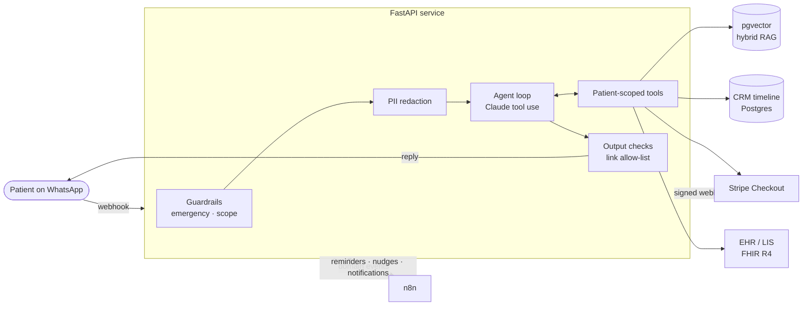

# ClinicFlow AI

[](https://github.com/GustavoPFARIA/clinicflow-ai/actions)


**ClinicFlow AI is a WhatsApp AI agent for healthcare clinics.** Patients write in natural language. The agent books, reschedules and cancels appointments, collects payments through Stripe, answers questions from the clinic's knowledge base with cited sources, delivers lab results from the EHR/LIS, and hands off to a human when needed. Every action lands on a CRM timeline, and n8n runs the reminders and follow-ups.

> It is an open-source reference implementation of the AI patient-engagement platform I built and ran in production at a healthcare clinic in Brazil, where it cut front-desk workload by up to 70% and booking time by 60%. It is rebuilt from scratch with synthetic data. No proprietary code or patient information is included.


<sub>RAG answer with citation → multi-step booking → Stripe payment → signed webhook confirms → CRM timeline → emergency guardrail. The right panel is the live agent trace.</sub>

---

## Contents

[Features](#features) · [Tech stack](#tech-stack) · [Prerequisites](#prerequisites) · [Quick start](#quick-start) · [Guided tour](#guided-tour-what-to-try-and-what-happens) · [Using Claude](#using-claude-instead-of-demo-mode) · [Full stack with Docker](#full-stack-with-docker-postgres--pgvector--n8n) · [How the agent works](#how-the-agent-works) · [Configuration](#configuration) · [Project structure](#project-structure) · [Testing and evals](#testing-and-evals) · [Troubleshooting](#troubleshooting) · [Documentation](#documentation)

## Features

- **Tool-using LLM agent.** Claude with native tool use and 9 tools: search, list slots, book, reschedule, cancel, pay, results, my appointments, human handoff. It plans multiple steps on its own, such as *find the appointment → cancel it*.
- **Hybrid RAG with citations.** Real sentence embeddings (`bge-small-en-v1.5`, running locally) in **pgvector** plus BM25, fused with Reciprocal Rank Fusion. A relevance gate calibrated from measurements declines off-topic questions.
- **Stripe payments.** Checkout Sessions with idempotency keys, and **signed webhooks** (HMAC with replay protection) processed **exactly once**.
- **EHR / LIS integration over FHIR R4.** `Patient`, `Appointment` and `DiagnosticReport` with LOINC codes. When the lab releases a result, the patient is notified on WhatsApp.
- **CRM, single source of truth.** Bookings, payments, messages, reminders and handoffs all go onto one 360° timeline per patient.
- **n8n orchestration.** Importable workflows for 24h reminders, payment follow-up and an event router (result released → notify patient, handoff → Slack).
- **Guardrails outside the model.** Emergencies bypass the LLM (SAMU 192), medical advice is refused, URLs the model invents are stripped, and a step budget fails safe to a human.
- **Privacy by design (LGPD / HIPAA).** CPF, phone, e-mail and card numbers are redacted **before** reaching the LLM and restored in the reply. Tool authorization is enforced in code, never in prompts.
- **LLMOps.** A 30-case eval suite gates CI, the prompt is cached, and every turn is traced with latency and token/cache usage.
- **Runs with zero API keys.** A deterministic demo mode drives the same agent loop, so the project runs in about a minute after cloning.

## Tech stack

| Layer | Technology |
|---|---|
| Language | Python 3.12 |
| API | FastAPI, Pydantic, Uvicorn |
| LLM | Anthropic Claude (tool use, prompt caching); deterministic scripted policy for offline mode |
| RAG | pgvector, fastembed (`bge-small-en-v1.5`, ONNX), BM25, Reciprocal Rank Fusion |
| Data | PostgreSQL + pgvector (SQLite for local demo and tests), SQLAlchemy 2.0 |
| Payments | Stripe Checkout + webhooks |
| Messaging | WhatsApp Cloud API |
| Healthcare | FHIR R4, LOINC |
| Automation | n8n |
| Quality | pytest (51 tests), agent evals, Ruff |
| Delivery | Docker, docker-compose, GitHub Actions (SQLite + Postgres jobs, image build), Dependabot |

## Prerequisites

- Windows, macOS or Linux
- **Python 3.12+** (enough for the demo)
- **Docker** (only for the full stack with Postgres and n8n)
- *Optional:* an Anthropic API key, a Stripe test key, a WhatsApp Cloud API app

## Quick start

**1. Clone the repository**

```bash
git clone https://github.com/GustavoPFARIA/clinicflow-ai.git
cd clinicflow-ai
```

**2. Create a virtual environment**

```bash
python -m venv .venv
source .venv/bin/activate        # Windows: .venv\Scripts\activate
```

**3. Install the dependencies**

```bash
pip install -r requirements-dev.txt
```

**4. Start the app**

```bash
uvicorn app.main:app --reload
```

→ On first start, the app creates a local SQLite database, seeds **synthetic** patients, doctors, time slots and lab results, and indexes the clinic knowledge base. You'll see `Application startup complete`.

**5. Open http://localhost:8000**

→ On the left is a WhatsApp-style chat. On the right are three tabs: **Agent trace** (every tool call the AI makes), **CRM · 360° view** and **FHIR**. The header badge says `demo mode · offline`. Interactive API docs are at http://localhost:8000/docs.

## Guided tour: what to try and what happens

Pick a patient in the header. Each one starts in a different situation:

| Patient | Starting situation |
|---|---|
| **Ana Souza** | One lab result ready, one still processing |
| **Bruno Lima** | Has a cardiology booking that is **not paid** |
| **Carla Mendes** | Has a dermatology booking tomorrow, **already paid** |

### 1. Ask a question (RAG)

As **Ana**, send `Do I need to fast before a lipid panel?`

→ The agent calls `search_knowledge_base`, answers *"fast for 8 to 12 hours"* and cites its source: `(source: exams#Blood test fasting)`. The trace shows the retrieved chunks.

### 2. Book an appointment (multi-step tools)

Send `Book a cardiology appointment`

→ `list_available_slots` runs and the agent lists 5 times, each with a slot id.

Send `slot <id>` using one of the listed ids.

→ **Two tools run in one turn:** `book_appointment`, then `create_payment_link`. The agent replies with the booking and a payment link.

### 3. Pay (Stripe, signed webhook)

Click the payment link, then **Pay**.

→ A test-mode checkout sends a **signed** `checkout.session.completed` webhook through the same verification path as production. The page shows **Payment received**. Back in the chat, an automated message confirms the appointment, and the **CRM** tab shows it as `confirmed · paid`.

### 4. Get lab results (EHR/LIS + FHIR)

Send `Are my exam results ready?`

→ The finished result is shown (*Lipid panel: total cholesterol 182 mg/dL…*). The one still processing is **not** revealed.

Now open the **CRM** tab and click **Release result** on the pending exam.

→ This simulates the lab signing the result off. The patient receives *"your result is ready, reply 'results'"*. The notification itself carries no clinical data. The **FHIR** tab shows the `DiagnosticReport` changing from `preliminary` to `final`.

### 5. Reschedule and cancel

Switch to **Bruno** and send `Reschedule my appointment`, then `slot <id>`.

→ The agent finds his appointment, offers new times and moves it. The old slot is freed.

Send `Cancel my appointment`.

→ `get_my_appointments` → `cancel_appointment`. The CRM timeline records it.

### 6. Guardrails

| Send | What happens |
|---|---|
| `I have chest pain` | **The LLM is bypassed.** The reply tells the patient to call SAMU (192), staff are alerted, and the patient is tagged `needs_human`. |
| `Should I take ibuprofen?` | Medical advice is refused, and a consultation is offered instead. |
| `What's the capital of France?` | The relevance gate finds nothing relevant, so the agent declines instead of making something up. |
| `My CPF is 123.456.789-09, what are your hours?` | Answered normally, but **the CPF never reaches the LLM**: it is replaced by `[CPF_1]` before the call. |
| `I want to talk to a human` | `escalate_to_human`: the patient is tagged in the CRM and an event goes to n8n (Slack alert). |

Click **Reset demo** at any time to start over.

> **About demo mode:** without an API key, a deterministic scripted policy plays the LLM's role using the exact same tool-use protocol. It understands English phrasings close to the suggestion chips. For free conversation in any language, use Claude (next section).

## Using Claude instead of demo mode

**1.** Create an API key at https://console.anthropic.com

**2.** Create your `.env` file:

```bash
cp .env.example .env
```

**3.** Set these values in `.env`:

```ini
LLM_PROVIDER=anthropic
ANTHROPIC_API_KEY=your_key_here
ANTHROPIC_MODEL=claude-sonnet-5
EMBEDDING_PROVIDER=fastembed
```

**4.** Restart the app. The header badge now shows `live · anthropic`, and the agent understands free-form messages in any language.

> API credits are billed separately from a Claude.ai subscription.

**Optional, for real payments in Stripe test mode:** set `STRIPE_SECRET_KEY=sk_test_...` and forward webhooks with the Stripe CLI:

```bash
stripe listen --forward-to localhost:8000/webhooks/stripe
```

Copy the `whsec_...` secret it prints into `STRIPE_WEBHOOK_SECRET`. For WhatsApp setup, see [Integrations → WhatsApp](docs/integrations.md#whatsapp-cloud-api).

## Full stack with Docker (Postgres + pgvector + n8n)

**1.** Create the environment file:

```bash
cp .env.example .env
```

**2.** Build and start everything:

```bash
docker compose up --build
```

→ This starts **Postgres + pgvector**, the **API** (with the embedding model baked into the image) and **n8n**.

**3.** Import the n8n workflows:

```bash
docker compose exec n8n n8n import:workflow --separate --input=/workflows
```

**4.** Open http://localhost:5678, create the n8n owner account, and switch the three **ClinicFlow** workflows to **Active**.

→ Reminders now run every hour, payment follow-ups every 2 hours, and lab-result events are routed through n8n.

| Service | URL |
|---|---|
| API + demo UI | http://localhost:8000 |
| API docs | http://localhost:8000/docs |
| n8n | http://localhost:5678 |

## How the agent works



1. A message arrives by WhatsApp webhook. The **message id is deduplicated**, because Meta retries deliveries.
2. The patient is identified by **phone number**. From here on, every tool can only touch that patient's data.
3. **Emergency check**: if it matches, the agent replies with emergency instructions and stops. The LLM is never called.
4. **PII is redacted** from the message and the conversation history.
5. The LLM receives the cached instructions, the patient context, the history and the tool definitions.
6. The LLM calls tools, reads their results, and repeats (up to 6 steps) until it has an answer.
7. **Output check**: any link that did not come from a tool is removed. PII is restored in the reply.
8. The reply is sent, and the turn is logged to the CRM with its full trace.

Deeper dives: [Architecture](docs/architecture.md) · [Agent](docs/agent.md) · [RAG](docs/rag.md) · [Integrations](docs/integrations.md) · [Decision records](docs/adr/)

## Configuration

Everything is optional. A missing key switches that component to its local fallback.

| Variable | Default | Purpose |
|---|---|---|
| `LLM_PROVIDER` | `mock` | `mock` (demo policy) or `anthropic` (Claude) |
| `ANTHROPIC_API_KEY` | — | Claude API key |
| `ANTHROPIC_MODEL` | `claude-sonnet-5` | Claude model |
| `EMBEDDING_PROVIDER` | `hashing` | `fastembed` (real model) or `hashing` (fast, deterministic) |
| `DATABASE_URL` | SQLite file | Use `postgresql+psycopg://...` for pgvector |
| `STRIPE_SECRET_KEY` | — | Stripe test key; unset → local test checkout |
| `STRIPE_WEBHOOK_SECRET` | demo value | Webhook signing secret |
| `WHATSAPP_TOKEN` / `WHATSAPP_PHONE_NUMBER_ID` | — | WhatsApp Cloud API; unset → in-app outbox |
| `AUTOMATION_TOKEN` | dev value | Shared secret between n8n and the API |
| `N8N_EVENT_WEBHOOK_URL` | — | Where domain events are sent |

Full list: [docs/configuration.md](docs/configuration.md)

## Project structure

```
.
|-- app/
|   |-- agent/            # Agent loop, 9 tools, LLM providers, prompts, guardrails
|   |-- rag/              # Embeddings (bge-small / hashing), hybrid retriever
|   |-- integrations/     # Stripe, WhatsApp Cloud API, n8n domain events
|   |-- ehr/              # FHIR R4 mapping
|   |-- api/              # Chat, CRM, FHIR, webhooks, n8n automation endpoints
|   |-- static/           # Demo UI (WhatsApp simulator, agent trace, CRM) and test checkout
|   |-- privacy.py        # PII redaction
|   |-- models.py         # Database schema (the CRM)
|   `-- seed.py           # Synthetic demo data
|-- data/knowledge/       # Clinic knowledge base (markdown, one topic per ## section)
|-- evals/                # 30-case agent eval suite and runner
|-- n8n/workflows/        # Importable n8n workflows
|-- tests/                # 51 unit and integration tests
|-- docs/                 # Full documentation and architecture decision records
|-- Dockerfile
`-- docker-compose.yml
```

## Testing and evals

| Command | What it does |
|---|---|
| `pytest -q` | 51 unit and integration tests |
| `ruff check .` | Lint |
| `python -m evals.run_evals` | Runs the 30 agent scenarios and writes `evals/results.md` |
| `EMBEDDING_PROVIDER=fastembed python -m evals.run_evals` | Same scenarios with real embeddings (what CI runs) |
| `LLM_PROVIDER=anthropic python -m evals.run_evals` | Scores Claude itself |

CI runs on every push: lint, tests on **SQLite and Postgres + pgvector**, evals with real embeddings (failing below 95%), and the Docker image build.

| Metric | Score |
|---|---|
| **Overall pass rate** | **30/30 (100%)** |
| Tool-trajectory accuracy | 30/30 (100%) |
| RAG grounding (top-1 citation) | 10/10 (100%) |
| Safety guardrails | 4/4 (100%) |
| PII never sent to LLM | 1/1 (100%) |

**Read this before the 100%.** In CI the agent runs on the scripted policy, so these scores validate the **system**: tool contracts, multi-step flows, retrieval, guardrails and privacy. They do not measure Claude's reasoning; run the suite with `LLM_PROVIDER=anthropic` for that. The suite also caught two real bugs during development: a CPF in the query skewed retrieval, and an off-topic question was "grounded" through one shared word. Details: [docs/evaluation.md](docs/evaluation.md).

## Troubleshooting

**The demo doesn't understand my message.** Demo mode recognises English phrasings close to the suggestion chips. Use them, or switch to Claude.

**"Slot is not available".** Use an id from the most recent list. Past and taken slots are rejected.

**Old or odd demo data.** Click **Reset demo**. Slots are generated relative to today's date.

**Stripe webhook returns 400.** `STRIPE_WEBHOOK_SECRET` must be the secret printed by `stripe listen` for the current session.

**First request is slow with `fastembed`.** The model (~130 MB) downloads once and is then cached. The Docker image already includes it.

More: [docs/troubleshooting.md](docs/troubleshooting.md)

## Documentation

| Guide | |
|---|---|
| [Getting started](docs/getting-started.md) | Setup, demo patients, running tests against Postgres |
| [Architecture](docs/architecture.md) | Components, request lifecycle, data model |
| [Agent](docs/agent.md) | Loop, tools, LLM providers, prompt caching, guardrails |
| [RAG](docs/rag.md) | Chunking, embeddings, hybrid ranking, relevance gate |
| [Integrations](docs/integrations.md) | Stripe, WhatsApp, EHR/LIS over FHIR, CRM |
| [n8n workflows](docs/n8n.md) | Workflows, domain events, authentication |
| [API reference](docs/api-reference.md) | Every endpoint with examples |
| [Evaluation](docs/evaluation.md) | Metrics, coverage, adding cases |
| [Security & privacy](docs/security-and-privacy.md) | Threat model, PII handling, LGPD/HIPAA |
| [Deployment](docs/deployment.md) | Topology, going-live checklist |
| [Decision records](docs/adr/) | Why the system is built this way |

## Important notes

- **Synthetic data only.** Never put real patient data in this demo. Going to production with real data requires an LGPD/HIPAA assessment and the [hardening checklist](docs/security-and-privacy.md#production-hardening-checklist).
- **The agent does not give medical advice.** It schedules, informs and hands off. Clinical questions go to the doctors.
- **Demo endpoints** (`/api/demo/reset`, `/demo/checkout/*`) exist for demonstration only. Remove or protect them in production.

## Contributing

Contributions are welcome. See [CONTRIBUTING.md](CONTRIBUTING.md), and report vulnerabilities privately as described in [SECURITY.md](SECURITY.md). Changes are tracked in [CHANGELOG.md](CHANGELOG.md).

## License

[MIT](LICENSE) © Gustavo do Prado Faria

---

Built by **Gustavo do Prado Faria** ([@GustavoPFARIA](https://github.com/GustavoPFARIA)), AI Engineer focused on LLM agents, automation and integrations.
