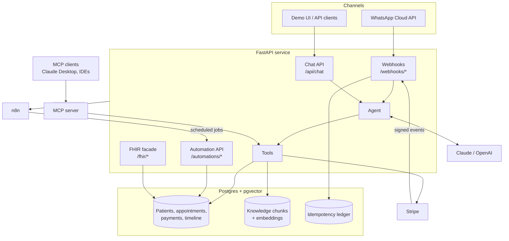
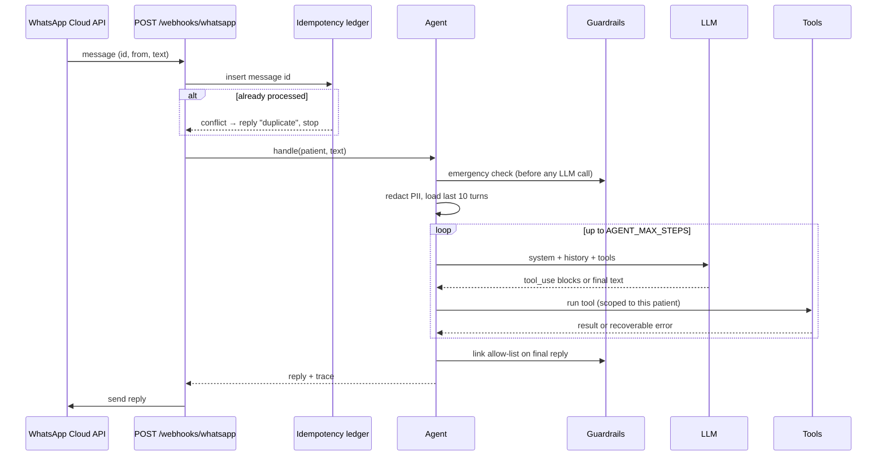
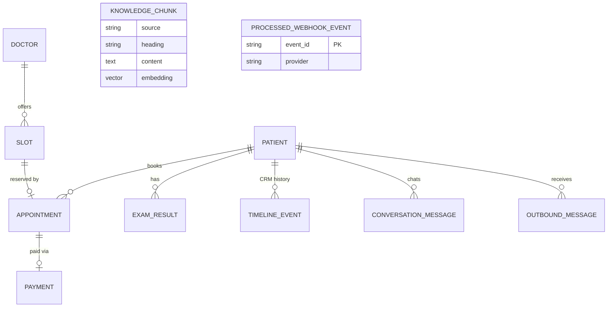

# Architecture

## Overview

ClinicFlow AI is a single FastAPI service plus two supporting systems: **Postgres/pgvector** (state, CRM and vector index) and **n8n** (time-based and event-driven automation). Every external provider sits behind a small interface with a local fallback, so the whole system also runs offline.

## Components

| Package | Responsibility |
|---|---|
| `app/agent/` | Agent loop, tool registry, LLM providers, system prompt, guardrails |
| `app/rag/` | Embedding providers, markdown chunking, hybrid retriever |
| `app/integrations/` | Stripe (`payments.py`), WhatsApp (`whatsapp.py`), n8n events (`events.py`) |
| `app/ehr/` | FHIR R4 mapping of internal models |
| `app/api/` | HTTP layer: chat/CRM/FHIR/LIS routes, provider webhooks, n8n automation endpoints |
| `app/mcp_server.py` | MCP server exposing the agent's tools to external AI clients |
| `app/privacy.py` | PII detection, redaction and restoration |
| `app/crm.py` | Timeline events, patient lookup by phone |
| `app/models.py` | SQLAlchemy models (the CRM schema) |
| `app/seed.py` | Synthetic demo data |

## Lifecycle of an inbound WhatsApp message

## Data model

**Appointment states:** `scheduled` (booked, unpaid) → `confirmed` (paid) → `completed`, or `cancelled` at any point. A cancelled paid appointment moves its payment to `refund_pending`.

## Design principles

1. **Business rules live in the API; orchestration lives in n8n.** Workflows only decide *when* to call the API. ([ADR-0004](adr/0004-api-owns-rules-n8n-owns-time.md))
2. **Authorization in code, not prompts.** Tools receive a `ToolContext` bound to the sender's phone number. ([ADR-0002](adr/0002-tool-authorization-in-code.md))
3. **Exactly-once side effects.** Provider event ids go through an idempotency ledger; outbound operations are idempotent. ([ADR-0005](adr/0005-idempotency-ledger.md))
4. **Deterministic by default.** A scripted policy and a hashing embedder keep tests and CI reproducible; real providers plug in via configuration. ([ADR-0001](adr/0001-scripted-policy-for-offline-mode.md))
5. **Fail safe to a human.** Step budget exhausted, emergency, or explicit request → escalate with context.
