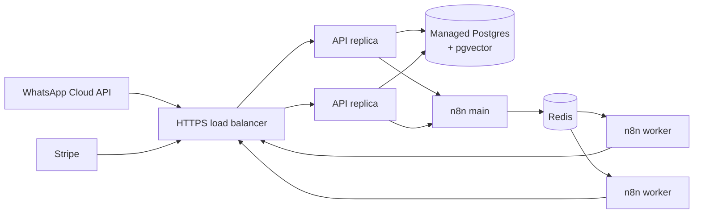

# Deployment

## Container image

The [`Dockerfile`](../Dockerfile):

- builds on `python:3.12-slim`,
- **pre-downloads the embedding model** at build time, so the first request is not slow,
- runs as a non-root user,
- exposes a `HEALTHCHECK` on `/health`.

```bash
docker build -t clinicflow-ai .
docker run -p 8000:8000 --env-file .env clinicflow-ai
```

CI builds this image on every push.

## Reference topology



- **API** is stateless: scale horizontally behind a load balancer. The idempotency ledger lives in Postgres, so duplicate webhook deliveries are safe across replicas.
- **Postgres** needs the `vector` extension (created automatically on startup).
- **n8n** in queue mode (`EXECUTIONS_MODE=queue` with Redis) moves executions to autoscaled workers.

## Going live checklist

1. **Database**: set `DATABASE_URL` to a managed Postgres with pgvector. Add Alembic migrations before the first schema change (tables are currently created with `create_all`).
2. **LLM**: `LLM_PROVIDER=anthropic`, `ANTHROPIC_API_KEY`. Run the eval suite against the chosen model first.
3. **Embeddings**: `EMBEDDING_PROVIDER=fastembed`, or a hosted model behind the `Embedder` protocol (re-calibrate `min_similarity`, see [RAG](rag.md#relevance-gate)).
4. **Stripe**: live key and a dashboard webhook endpoint for `checkout.session.completed` and `charge.refunded`; copy its signing secret into `STRIPE_WEBHOOK_SECRET`.
5. **WhatsApp**: permanent system-user token, a registered webhook, and approved message templates for messages sent outside the 24-hour customer-service window (reminders, nudges and result notifications).
6. **n8n**: import and activate the workflows; set `N8N_EVENT_WEBHOOK_URL` on the API.
7. **Security**: complete the checklist in [Security & privacy](security-and-privacy.md#production-hardening-checklist).
8. **Observability**: ship logs; alert on webhook `400`s, `handoff.requested` volume, and agent latency.
9. **Demo endpoints**: `/api/demo/reset` and `/demo/checkout/*` exist for demonstrations. Remove or protect them in production.
