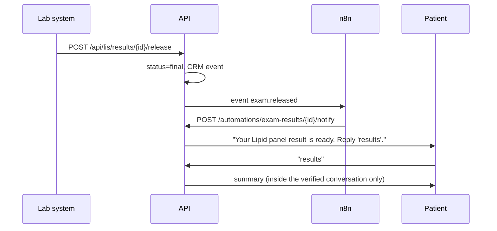

# Integrations

## Stripe

Source: [`app/integrations/payments.py`](../app/integrations/payments.py)

### Checkout

`get_or_create_checkout(db, appointment)` returns the appointment's existing `Payment`, or creates one:

- **Live** (`STRIPE_SECRET_KEY` set): `stripe.checkout.Session.create(...)` with `metadata.appointment_id` and `idempotency_key=f"checkout-appointment-{id}"`. Retries of the same request never create two sessions.
- **Demo** (no key): a local session id `cs_demo_*` and a test-mode checkout page at `/demo/checkout/{id}`.

### Webhooks

`POST /webhooks/stripe` → `verify_signature` → `handle_event`:

1. **Signature**: parses `Stripe-Signature: t=<ts>,v1=<sig>`, recomputes `HMAC-SHA256(secret, "<ts>.<payload>")` and compares in constant time. Rejects timestamps older than 300 s (replay protection). Returns `400` on failure.
2. **Idempotency**: inserts the event id into `processed_webhook_events`. A duplicate returns `{"outcome": "duplicate"}` with no side effects.
3. **Handling**:

| Event | Effect |
|---|---|
| `checkout.session.completed` (`payment_status=paid`) | Payment `paid`, appointment `confirmed`, CRM event, WhatsApp confirmation, `payment.succeeded` event |
| `charge.refunded` | Payment `refunded`, CRM event |
| anything else | Recorded and ignored |

The demo checkout's **Pay** button builds a real-shaped event, signs it with `STRIPE_WEBHOOK_SECRET` and pushes it through this exact path.

## WhatsApp Cloud API

Source: [`app/integrations/whatsapp.py`](../app/integrations/whatsapp.py), [`app/api/webhooks.py`](../app/api/webhooks.py)

### Setup

1. Create a Meta app with the WhatsApp product and get a **phone number id** and an **access token**.
2. Set `WHATSAPP_TOKEN`, `WHATSAPP_PHONE_NUMBER_ID` and choose a `WHATSAPP_VERIFY_TOKEN`.
3. Expose the API publicly (for example with `ngrok http 8000`) and register `https://<host>/webhooks/whatsapp` as the callback URL, using the same verify token. Subscribe to `messages`.

### Behavior

- `GET /webhooks/whatsapp` answers Meta's `hub.challenge` handshake.
- `POST /webhooks/whatsapp` extracts text messages, **dedupes on the message id** (Meta retries deliveries), looks the sender up by phone, runs the agent and sends the reply.
- Unknown senders are ignored (`unknown_sender`). A production deployment would route them to an onboarding flow.
- Outbound messages are always stored in `outbound_messages`. Without credentials that table *is* the transport, and the demo UI renders it as the patient's phone.

## EHR / LIS (FHIR R4)

Source: [`app/ehr/fhir.py`](../app/ehr/fhir.py)

The internal models stay simple; the integration boundary speaks **FHIR R4**, so a real EHR's FHIR API can replace the synthetic data without touching the agent.

| Internal | FHIR resource | Notes |
|---|---|---|
| `Patient` | `Patient` | name split into given/family, phone and e-mail as `telecom` |
| `Appointment` | `Appointment` | status mapped to `booked` / `fulfilled` / `cancelled`, 30-min duration |
| `ExamResult` | `DiagnosticReport` | LOINC `code`, category `LAB`, `conclusion` **only when status is `final`** |

### Result delivery flow

If n8n does not accept the event, the API sends the notification inline, so a down automation layer never blocks a patient.

## CRM

Source: [`app/crm.py`](../app/crm.py), [`app/models.py`](../app/models.py)

Every patient-facing action writes a `TimelineEvent(kind, summary, data)`:

`appointment.booked` · `appointment.rescheduled` · `appointment.cancelled` · `payment.link_created` · `payment.succeeded` · `payment.refunded` · `payment.nudge` · `reminder.sent` · `exam.released` · `exam.notified` · `exam.delivered` · `handoff.requested` · `conversation.turn`

`GET /api/patients/{id}/crm` returns the 360° view: profile and tags, appointments with payment state, exams, timeline, conversation and outbound messages. To sync with an external CRM such as HubSpot, subscribe an n8n workflow to the domain events (see [n8n](n8n.md)).
