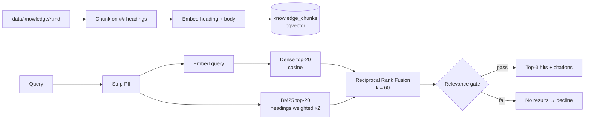

# Retrieval-augmented generation

Source: [`app/rag/`](../app/rag)

## Pipeline

## Chunking

Each `## Heading` section of a markdown file becomes one chunk. The citation is `<file-stem>#<heading>`, for example `exams#Blood test fasting`. Sections are short and self-contained by design; this beats fixed-size windows for FAQ-style content.

## Embeddings

Selected with `EMBEDDING_PROVIDER`:

| Provider | Model | Dim | Used by |
|---|---|---|---|
| `fastembed` | `BAAI/bge-small-en-v1.5` (local ONNX, no API key) | 384 | Docker, CI evals |
| `hashing` | Feature hashing of words, bigrams and char trigrams | 384 | Unit tests (fast, deterministic) |

Queries use the model's query encoder (`query_embed`) and documents the passage encoder (`passage_embed`). On Postgres the vectors live in a `vector(384)` column and are searched with pgvector's cosine distance; on SQLite, cosine is computed in Python.

## Hybrid ranking

- **Dense** catches paraphrases: *"can I get my money back if I cancel"* → *Cancellation and rescheduling policy*.
- **BM25** catches exact terms: exam names, insurance plans (*Unimed*), LOINC-style names.
- **Reciprocal Rank Fusion** combines the two rankings without calibrating their scores against each other. Ties are broken by keyword score.

## Relevance gate

A chunk is returned only if **either**:

- cosine similarity ≥ the provider's `min_similarity`, **or**
- at least 30% of the (non-stopword) query terms appear in it.

Without the gate, *"What is the capital of France?"* would be "answered" from whichever chunk happens to be nearest.

The `bge-small` threshold (0.62) was set from measurements, not guessed:

| Query set | Top-1 cosine |
|---|---|
| 12 in-scope questions, including paraphrases | 0.68 – 0.89 (12/12 correct top-1) |
| 5 off-topic questions | 0.43 – 0.57 |

If you change the model, re-measure and set the new `min_similarity` on its `Embedder` class.

## Adding knowledge

1. Add or edit a markdown file in `data/knowledge/`. Use one `##` section per topic, and write the heading the way a patient would ask about it.
2. Restart the app, or call `POST /api/demo/reset`, to re-index.
3. Add an eval case with `expect_citation` so retrieval regressions are caught in CI.
